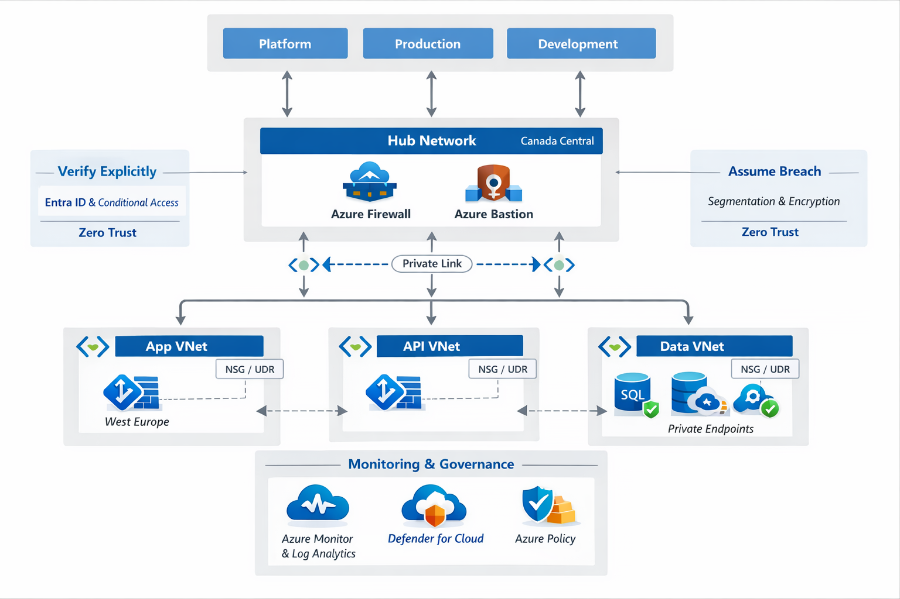

# CloudMed Solutions – Zero Trust Azure Landing Zone

## 1. Company Overview

CloudMed Solutions Inc. is a healthcare technology company delivering cloud-based telemedicine and patient management platforms across Canada, the U.S., and Europe. Its main product, MedConnect, supports secure telehealth sessions, electronic medical record (EMR) management, and AI-based health analytics.

Because CloudMed handles highly sensitive patient data across multiple regions and devices, a traditional perimeter-based model is not sufficient. A Zero Trust architecture ensures that every access request is verified and secured.

Key drivers:
- Compliance with HIPAA (U.S.), GDPR (EU), and PIPEDA (Canada)
- Multi-region deployment (Canada Central, West Europe)
- Protection of sensitive health data
- Need for centralized governance, monitoring, and cost control

---

## 2. Governance and Identity

### Management Group Hierarchy

Root  
└── CloudMed  
  ├── Platform  
  │ ├── Identity  
  │ ├── Connectivity  
  │ └── Management  
  ├── Production  
  │ ├── App  
  │ ├── API  
  │ └── Data  
  └── Development    
  
  **Why this works**
- Policy inheritance from top → consistent governance  
- Clear separation of duties and environments  
- Easier cost allocation and reporting by scope  

This hierarchy enables consistent policy enforcement, access control, and cost tracking across environments.

### Governance Model

- **RBAC**
  - Admin: full control of resources and policies  
  - DevOps: deploy and manage applications  
  - Finance: read-only access to cost and billing  
  - Access assigned via groups to enforce least privilege  

- **Azure Policy**
  - Enforce tagging (Environment, CostCenter)  
  - Restrict allowed regions  
  - Require encryption for storage and databases  
  - Block creation of public IPs for sensitive workloads  

- **Azure Entra ID**
  - Central identity provider  
  - MFA and Conditional Access enforced  
  - Privileged Identity Management (PIM) for just-in-time admin access  

---

## 3. Network Architecture

- **Hub-and-Spoke Model**
  - Hub VNet hosts shared services: Firewall, Bastion, DNS, Log Analytics  
  - Spoke VNets host workloads (App, API, Data)  
  - Separate hubs per region for compliance and availability  

- **Workload Isolation**
  - App, API, and Data tiers deployed in separate VNets  
  - Subnet-level segmentation inside each spoke  
  - NSGs applied to control traffic between subnets  

- **Traffic Control**
  - User Defined Routes (UDRs) force traffic through Azure Firewall  
  - No direct communication between spokes unless required  
  - East–west traffic is inspected and restricted  

- **Private Endpoints**
  - Azure SQL and Storage accessed via Private Link  
  - No exposure to public internet  

---

## 4. Zero Trust Controls

### Verify Explicitly
- Azure Entra ID authentication for all users and services  
- MFA required for all access  
- Conditional Access based on device, location, and risk  
- Continuous validation of identity and session  

### Least Privilege Access
- RBAC with minimal required permissions  
- Role assignments at management group/subscription level  
- Just-in-Time (JIT) access using PIM  
- Separation of duties between teams  

### Assume Breach
- Network segmentation using hub-spoke architecture  
- Encryption for data at rest and in transit  
- Continuous monitoring with Azure Monitor  
- Threat detection using Defender for Cloud  

### Design Examples
- Azure Bastion for secure administrative access (no public IPs)  
- Private Link for SQL and Storage  
- Azure Policy to deny public exposure  
- Azure Firewall for centralized traffic inspection  
- NSGs to restrict subnet communication  

---

## 5. Monitoring, Compliance, and Cost

### Monitoring
- Azure Monitor collects metrics, logs, and diagnostics  
- Log Analytics workspace for centralized logging  
- Alerts configured for performance and security issues  
- Defender for Cloud provides threat detection and recommendations  

### Compliance
- Azure Policy enforces security and compliance standards  
- Policies applied at management group level  
- Defender for Cloud compliance dashboard tracks HIPAA, GDPR, PIPEDA  
- Continuous assessment and remediation of non-compliant resources  

### Cost Control
- Budgets defined per subscription with alert thresholds  
- Resource tagging for cost allocation (Environment, Department)  
- Azure Cost Management for usage analysis  
- Optimization through identifying idle or underutilized resources  

---

## 6. Conceptual Diagram

The diagram illustrates:   
- Management groups (Platform, Production, Development)   
- Hub-and-spoke VNets per region
- Central security (Firewall, Bastion), Private Endpoints
- Monitoring (Log Analytics) and governance layers
- Zero Trust applied: verify (identity), least privilege (RBAC), assume breach (segmentation)

---

## 7. Summary and Recommendations

### Design Rationale
- Identity-first security model using Entra ID  
- Segmented network reduces attack surface  
- Policy-driven governance ensures compliance  
- Modular design supports scalability and expansion  

### Recommendations
1. Implement Infrastructure as Code (Bicep/Terraform) for consistent deployments and faster provisioning  
2. Enhance cost optimization using auto-scaling, reserved instances, and continuous cost monitoring  
